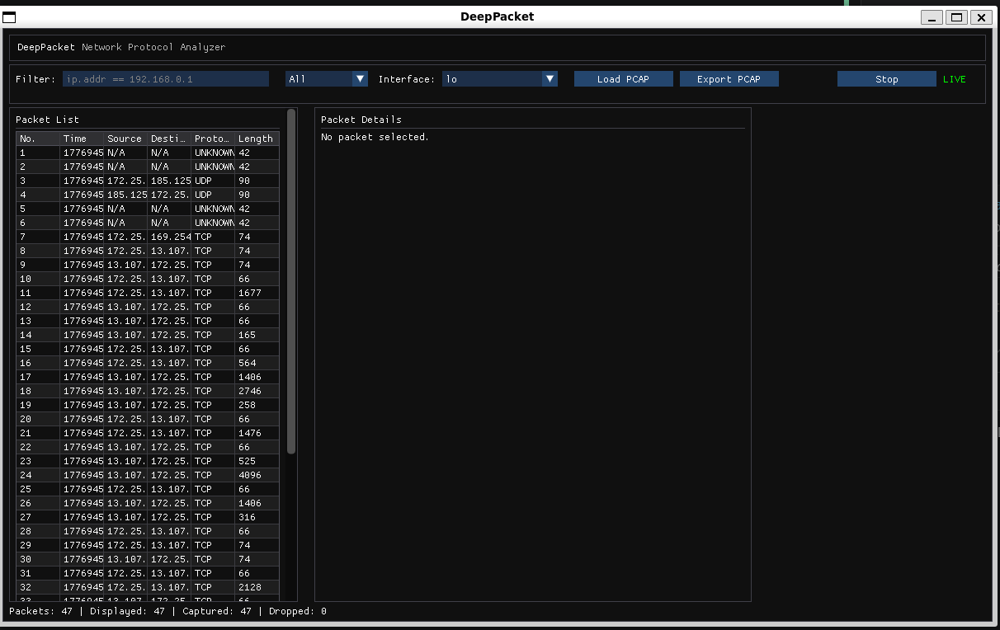

# DeepPacket

A zero-copy network packet inspection tool with live capture, protocol parsing, validation, and a lightweight Wireshark-style UI.

> **Status:** v1 complete
> (IPv6 + Python bindings planned)

---

## Overview

DeepPacket is a lightweight packet analysis tool inspired by Wireshark.
It captures raw Ethernet frames from a Linux network interface, parses protocol layers, validates fields against RFC rules, and displays results through both a custom ImGui-based UI and a headless command-line interface (dpctl).

The project explores systems-level engineering concepts including:

* Raw socket capture
* Zero-copy binary parsing
* RFC-aware validation
* Real-time UI rendering
* PCAP ingestion and export
* Non-blocking CLI for live capture and analysis.

DeepPacket aims to replicate a small, educational subset of Wireshark’s functionality while maintaining a clean, modular architecture. The modular architecture of the parser and validation layers allow seamless integration of more protocols in addition to the ones natively supported.

A major design goal is stability and minimalism.  
DeepPacket is built with **no libpcap** and **no third‑party protocol parsers** — all capture, parsing, validation, and serialization logic is implemented manually.  
Only lightweight UI libraries (Dear ImGui and ImGuiFileDialog) are vendored; platform components such as GLFW and OpenGL are used as **system dependencies**.

---

## Current Features

DeepPacket is organized around a unified engine namespace (dp/), with each subsystem implemented as a modular component and compiled into a single static library (dp_engine).

```bash
DeepPacket/
├── dp/                  # Core engine (dp_engine)
│   ├── engine/          # Unified DeepPacket API
│   ├── core/            # High-level orchestration (capture control, summaries)
│   ├── capture/         # Raw socket capture (linux only for now) + ring buffer
│   ├── parser/          # Zero-copy protocol parsing
│   ├── validation/      # RFC-aware validation logic
│   ├── serialization/   # Export/load functionality
│   └── pcap/            # PCAP reader/writer
│
├── app/                 # ImGui-based UI application
├── tests/               # Unit and integration tests
├── cli/                 # dpctl cli
├── third_party/         # Vendored dependencies (ImGui, ImGuiFileDialog)
└── build/               # Build output (generated)
```

All modules under dp/ share a consistent namespace (dp::<module>) and are designed to be composable, allowing the UI and test suite to reuse the same packet processing pipeline.

---

## Current Features

### Capture & PCAP

* Live packet capture using Linux raw sockets
* PCAP file ingestion (offline analysis mode)
* PCAP export (validated in Wireshark)
* Automatic mode switching (Live ↔ PCAP)

### Protocol Support

Zero-copy parsing + validation for:

* Ethernet II
* IPv4
* ARP
* TCP
* UDP
* ICMP

### UI (ImGui-based for now)

* Real-time packet list with timestamps, IPs, protocol, and length
* Packet details panel with:

  * Summary fields
  * Layer breakdown (Ethernet/IP/TCP/UDP/ICMP)
  * Validation results
* Hex viewer with offset, hex, and ASCII columns
* Resizable split panes
* Load/Export PCAP buttons
* Start/Stop live capture
* Interface selection
* Filter input (UI only for now, functionality yet to be implemented)

### CLI (dpctl)

* Non‑blocking interactive REPL for live capture and PCAP analysis
* Real‑time packet stream output with indices, IPs, protocol, length, and validation status
* Commands include:
  - interfaces — list available network interfaces
  - live <iface> — start live capture
  - stop — stop live capture
  - read <pcap> — load and summarize a PCAP file
  - view <index> — detailed packet breakdown in text form
  - export <pcap> — export current capture to PCAP
  - info, help, quit

### Validation

* Field-level validation for supported protocols
* Error reporting per packet
* RFC-aware checksum and header checks

### Testing

* Extensive test suite covering:

  * Parsing
  * Validation
  * Serialization
  * PCAP read/write

---

## Why DeepPacket ?

DeepPacket is not a wrapper around libpcap or a thin UI over existing packet libraries.
It is a **from‑scratch** packet inspection engine designed to expose how packet capture, parsing, and validation actually work beneath higher‑level tools like Wireshark.

Most packet analyzers rely heavily on libpcap for capture, buffering, filtering, and device abstraction.

DeepPacket instead implements:
- Raw socket capture without external dependencies(linux-only, extendable due to modular architecture)
- Zero‑copy parsing for predictable, low‑latency performance
- RFC‑aware validation for detecting malformed or offloaded packets
- A clean, modular backend engine shared by both UI and CLI
- A small, readable codebase suitable for teaching and experimentation

This makes DeepPacket ideal for:
- Systems programming and networking education
- Research prototypes and custom protocol experimentation
- Embedded or constrained environments where large dependencies are undesirable

DeepPacket focuses on clarity, control, and modularity.
It is intentionally minimal, making it easier to understand, extend, and integrate than large, production‑scale tools.

---

## Parallelization & Architecture

DeepPacket uses a lightweight, high‑performance multithreaded architecture designed for real‑time packet capture without UI stalls.

### Thread Model

DeepPacket currently runs two primary threads:

**1. Capture Thread (Producer)**  
Created by `CaptureController::start_live_capture()`.  
This thread:
- Opens the raw socket  
- Blocks on `recvfrom()`  
- Captures raw Ethernet frames  
- Produces `PacketSummary` objects  
- Pushes them into a custom lock‑free SPSC ring buffer  

**2. UI Thread (Consumer)**  
The main thread running the ImGui event loop.  
This thread:
- Polls the ring buffer  
- Consumes packet summaries  
- Updates the packet list  
- Performs full parsing + validation when a packet is selected  
- Renders the UI  

### Lock‑Free Ring Buffer

DeepPacket implements its own **single‑producer, single‑consumer ring buffer** to avoid:

- mutex contention  
- blocking queues  
- unnecessary memory copies  
- UI freezes under heavy traffic  

This design ensures:
- real‑time packet ingestion  
- smooth UI rendering  
- predictable performance  
- minimal latency between capture and display  

---

## Planned Features / Ideas for features

* IPv6 parsing + validation
* Additional pipeline parallelization.
* UI performance improvements
* Optional migration to Qt-based UI 
* Additional protocol support
* Filter engine (BPF-like or custom)
* CLI enhancements

---

## Build Instructions

DeepPacket uses **CMake**.

### 1. Configure & Build

From the project root:

```bash
./build.sh
```

### 2. Executables

The build produces:

* `deeppacket-tests` — test suite
* `deeppacket` — graphical packet analyzer
* `dpctl` — command-line packet analyzer

### 3. Run Tests

```bash
sudo ./build/tests/deeppacket-tests > output.txt
```

### 4. Run the UI

```bash
sudo ./build/app/deeppacket
```

### 5. Run the CLI

```bash
sudo ./build/cli/dpctl
```

> Root privileges are required for raw socket capture.

---

## Screenshot




---

## Third-Party Libraries

DeepPacket vendors a small set of lightweight UI libraries:

* [Dear ImGui](https://github.com/ocornut/imgui) — Immediate‑mode GUI framework (MIT)
* [ImGuiFileDialog](https://github.com/aiekick/ImGuiFileDialog) — File dialog widget for ImGui (MIT)

These libraries are included directly in the `third_party/` directory.

DeepPacket also relies on the following **system-provided** dependencies:

* **GLFW** — Windowing + input backend (zlib/libpng), installed via system package manager  
* **OpenGL** — Provided by the system’s graphics drivers (Mesa/NVIDIA/AMD)

Only the vendored libraries are stored in the repository; system dependencies must be installed separately.

---

## License

DeepPacket © 2026 John Varghese — All Rights Reserved
Licensed under Creative Commons Attribution‑NonCommercial‑NoDerivatives 4.0 International  
(CC BY‑NC‑ND 4.0)

This license allows others to view and share the project with attribution,
but prohibits commercial use, modification, or redistribution of derivative works.

Full license text:
https://creativecommons.org/licenses/by-nc-nd/4.0/legalcode

---

## Notes

* DeepPacket is still under active development and may be worked on every now and then.
* Some UI elements (e.g., filter box) are placeholders for future features.
* Interface auto-detection is implemented, but fallback defaults to default value of `enp0s3` if unavailable.
